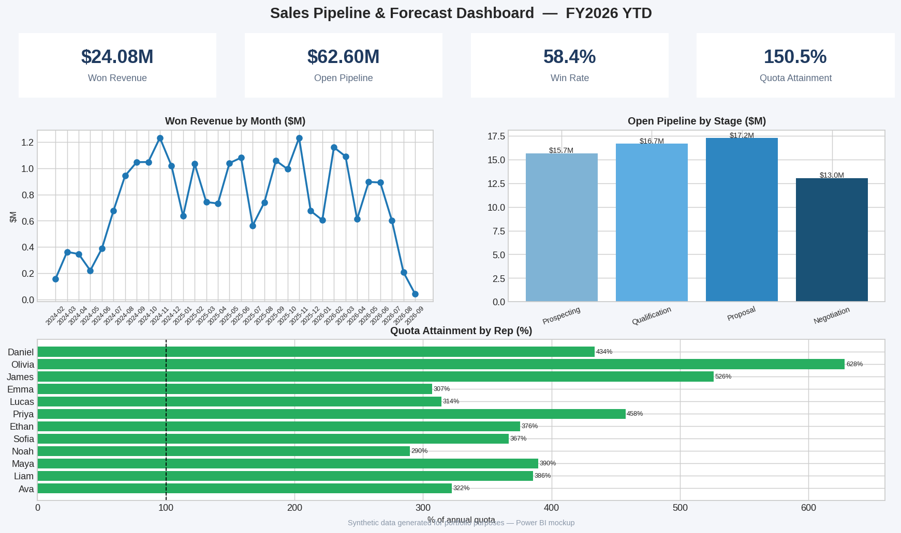

# Sales Pipeline & Forecast Dashboard (Power BI)

A sales operations dashboard answering the questions a revenue leader asks every Monday: how much did we close, what's in the pipe, who's hitting quota, and can we trust the forecast?

## What it shows

- **KPI cards** — Won revenue, open pipeline value, win rate, quota attainment
- **Won revenue trend** — monthly closed-won revenue to spot seasonality and slippage
- **Pipeline by stage** — where deals sit right now, so coaching targets the right stage
- **Quota attainment by rep** — per-rep performance vs. annual quota with a 100% reference line

## How to rebuild it in Power BI

1. Import `data/crm_opportunities.csv` and `data/sales_reps.csv`
2. Model per `data_dictionary.md` (star schema + date table on close_date)
3. Add the measures from `dax_measures.dax`
4. Lay out per `dashboard_mockup.png`: KPI row on top, trend + stage funnel in the middle, rep attainment table/bar at the bottom
5. Add slicers for Region, Forecast Category, and Close Date (relative: last 12 months)

## Key design decisions

- **Weighted pipeline** uses stage-based probabilities (10/25/50/75%) so the forecast reflects deal maturity, not just raw pipe
- **Quota attainment** is trailing-12-months won vs. annual quota — comparing multi-year history against an annual target would overstate performance
- Forecast categories (Commit / Best Case / Pipeline) mirror how Salesforce opportunity records are actually managed

## Skills demonstrated

Power BI data modeling (star schema, date table) · DAX (CALCULATE, SUMX, AVERAGEX, time intelligence) · KPI design · sales operations domain knowledge

*All data is synthetic and generated for portfolio purposes.*
