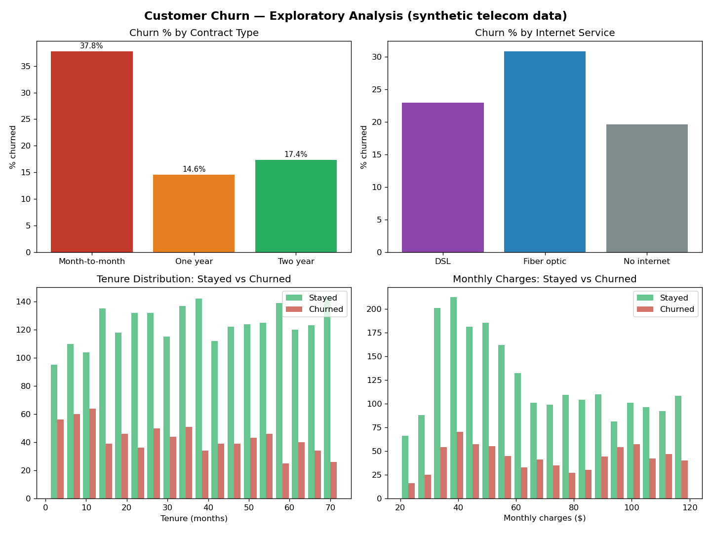

# Customer Churn Analysis (Python)

Which customers are most likely to leave, and what drives it? Exploratory analysis plus a from-scratch logistic regression on 3,000 synthetic telecom customers.

## Approach

1. **EDA** — churn rates by contract type, internet service, tenure, and monthly charges
2. **Feature encoding** — tenure, month-to-month flag, fiber flag, normalized charges
3. **Logistic regression implemented from scratch** (gradient descent, no sklearn) to keep the mechanics transparent; 80/20 train/test split

Run it: `python3 churn_analysis.py` (stdlib + matplotlib only)

## Findings

- Overall churn: **25.7%**
- **Month-to-month contracts churn at 37.8%** vs 14.6% on one-year — the single biggest lever
- Fiber optic customers churn more (30.9%) than DSL (22.9%) — likely price sensitivity, since fiber bills run higher
- Churners skew toward **low tenure + high monthly charges**
- Model: **76.8% accuracy**, but only 10.6% recall on churners — it spots the obvious cases and misses the quiet ones

## What I'd do next

- Tune the decision threshold and add class weights to trade precision for recall
- Add interaction terms (tenure × contract) and test a tree-based model for comparison
- Build a monthly churn-risk score feed for the retention team — the real business output

## Skills demonstrated

Python (stdlib, matplotlib) · EDA · feature engineering · logistic regression from scratch · honest model evaluation (accuracy vs. precision/recall)

*All data is synthetic and generated for portfolio purposes.*
