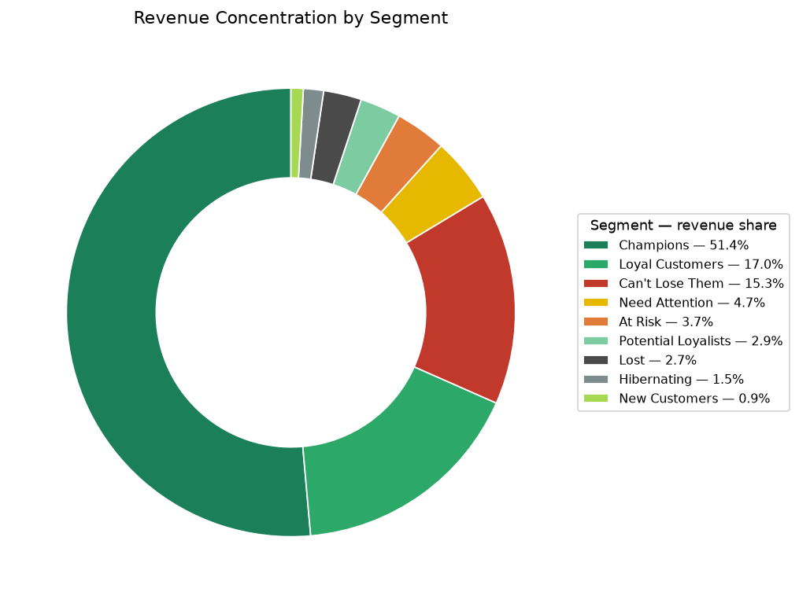

# RFM Customer Segmentation (SQL + Python)

Who gets the win-back email, who gets the upsell call, and who should we stop spending on? This project answers those questions with RFM analysis — the classic sales-ops/retention framework — on 2,000 customers and ~2 years of transaction history.

## Business problem

Marketing and sales waste budget treating every customer the same. RFM (Recency, Frequency, Monetary) scores each customer on buying behavior so retention spend goes where it moves the needle:

1. **Who are our best customers?** — protect and expand them
2. **Who is slipping away?** — prioritize win-back by dollars at stake
3. **Who is already gone?** — stop spending acquisition-style dollars on them

## Method

1. `generate_data.py` builds a synthetic SQLite database (`data/customers.db`): 2,000 customers × ~23,300 transactions (seed 42, fully reproducible).
2. `rfm_analysis.sql` computes Recency (days since last purchase vs. a fixed as-of date, 2026-09-30), Frequency, and Monetary per customer, scores each 1–5 with `NTILE` quintiles, and assigns one of 9 segments with a priority-ordered `CASE` (Champions, Loyal Customers, Can't Lose Them, At Risk, New Customers, Potential Loyalists, Need Attention, Hibernating, Lost).
3. `segment_analysis.py` re-runs the SQL, summarizes segments in pandas, saves 4 charts, and writes `results.md`.

Portable SQL: CTEs + window functions run on Postgres, SQL Server, Snowflake, and BigQuery.

```bash
python generate_data.py          # build data/customers.db
sqlite3 data/customers.db < rfm_analysis.sql   # run the segmentation
python segment_analysis.py       # charts + results.md
```

## Key findings (see results.md)

- **Extreme concentration:** 800 customers (**40%** of the base) drive **$14.9M — 83.7% of revenue**. Champions alone: 496 customers (24.8%) → $9.16M (51.4%).
- **The win-back list is worth $3.6M:** 413 customers in "Can't Lose Them" + "At Risk" + "Hibernating" hold $3,631,362 of historical revenue. "Can't Lose Them" (122 customers, avg $22,292 lifetime) are the highest-value accounts in the whole base — and they've gone quiet (avg 314 days since last purchase).
- **Lost is lost:** 387 customers (19.4% of the base) generated only $486K (2.7% of revenue), avg 603 days dormant. Don't burn win-back budget here.
- **New-customer pipeline is thin:** only 124 new customers (6.2%) at $1,271 average — acquisition needs attention if growth is a goal.
- Median recency is 179 days and 562 customers (28.1%) haven't purchased in over a year.



## Recommended plays per segment

| Segment | Size / Revenue | Play |
|---|---|---|
| Champions | 496 / $9.16M | VIP treatment: early access, referral program, expansion/upsell offers |
| Loyal Customers | 182 / $3.02M | Loyalty rewards, cross-sell into new product lines |
| Can't Lose Them | 122 / $2.72M | **Highest priority win-back**: exec outreach, "we miss you" offer, survey why they left |
| At Risk | 146 / $0.65M | Triggered re-engagement at 90–120 days dormant; time-limited offer |
| Potential Loyalists | 180 / $0.52M | Nurture: onboarding content, second-purchase incentive |
| New Customers | 124 / $0.16M | Onboarding journey, first-90-days check-in, review request |
| Need Attention | 218 / $0.83M | Light-touch nurture; watch for slip into At Risk |
| Hibernating | 145 / $0.26M | Low-cost reactivation (email); no expensive outreach |
| Lost | 387 / $0.49M | Suppress from paid win-back; keep on newsletter only |

## Skills demonstrated

SQL (CTEs, `NTILE()` window functions, date math, conditional aggregation with `CASE`) · Python/pandas (segmentation summaries, matplotlib reporting) · translating analysis into prioritized go-to-market actions · retention and revenue-concentration domain thinking

*All data is synthetic and generated for portfolio purposes (seed 42).*
